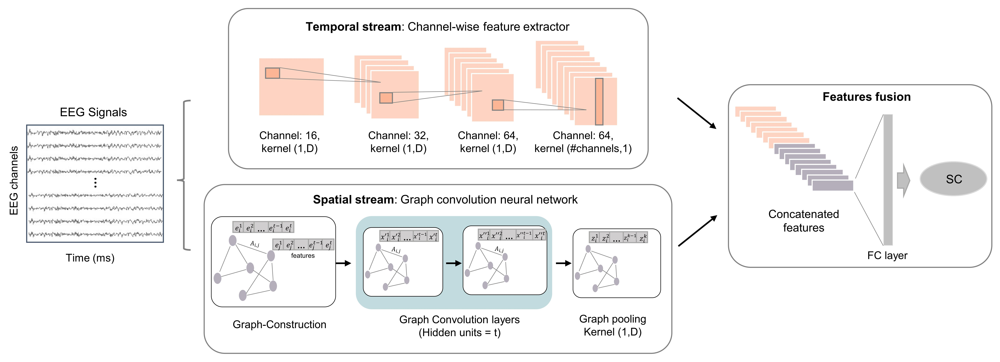
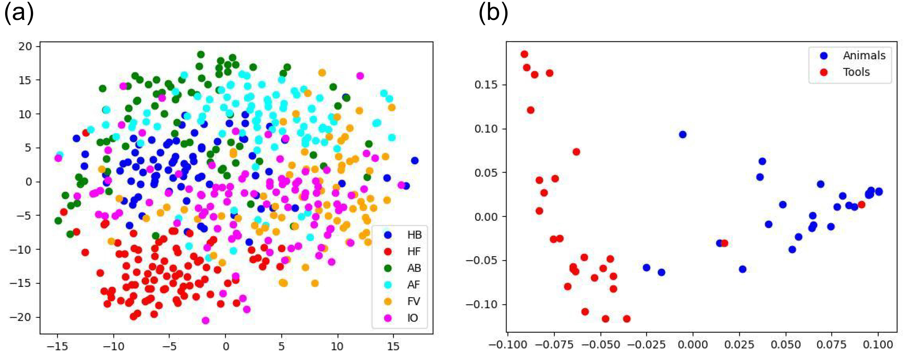

# Learning-Spatiotemporal-Graph-Representations-for-Visual-Perception-using-EEG-Signals

## Abstract

Perceiving and recognizing objects enable interaction with the external environment. Recently, decoding brain signals based on brain-computer interface (BCI) that recognize the user’s intentions by just looking at objects has attracted attention as a next-generation intuitive interface. However, classifying signals from different objects is very challenging, and in practice, decoding performance for visual perception is not yet high enough to be used in real environments. In this study, we aimed to classify single trial electroencephalography (EEG) signals depending on the provided visual stimulus into their corresponding semantic category; we use two public datasets; (i) SU DB (a set of 72 photographs of objects belonging to 6 semantic categories) and MPI DB (8 exemplars belonging to two categories). We proposed two-stream graph convolutional neural networks to increase the classification performance. The model consists of the spatial stream using a graph convolutional neural network and the temporal stream using a channel-wise convolutional neural network. Finally, we compared our results with the state-of-the-art methods and ablations studies. Our
results outperformed other conventional methods, with accuracies of 54.28 ± 7.89% for SU DB (6-class) and 84.40 ± 8.03% for MPI DB (2-class). These results could facilitate the application of intuitive BCI systems based on visual perception.

## Requirements
Python 3 

* pytorch == 1.10.2
* torch_geometric 
* numpy >= 1.17.5 
* scipy >= 1.1.0 
* scikit-learn >= 0.22.2
* matplotlib

## Dataset 
We used two public datasets in this study:
* [SU DB](https://purl.stanford.edu/bq914sc3730) (Kaneshiro et al., 2015)
* [MPI DB](https://journals.plos.org/plosone/article?id=10.1371/journal.pone.0014465) (Simanova et al., 2010)

## Modules
We provide Python implementation for training the proposed model and its evaluation.
* data_loader: prepare data to input to the model
* model.py : Proposed model architecture 
* train.py : Training the model and predicting labels
* plot_tsne : Graph tsne plots and dendograms
* metrics: Evaluates the model using different metrics 

## Some Results
* t-SNE plots for a representative subject. (a) SU DB (Sub 06) and (b) MPI (Sub 15)

## Citing
When using this code in a scientific publication, please cite us as:

